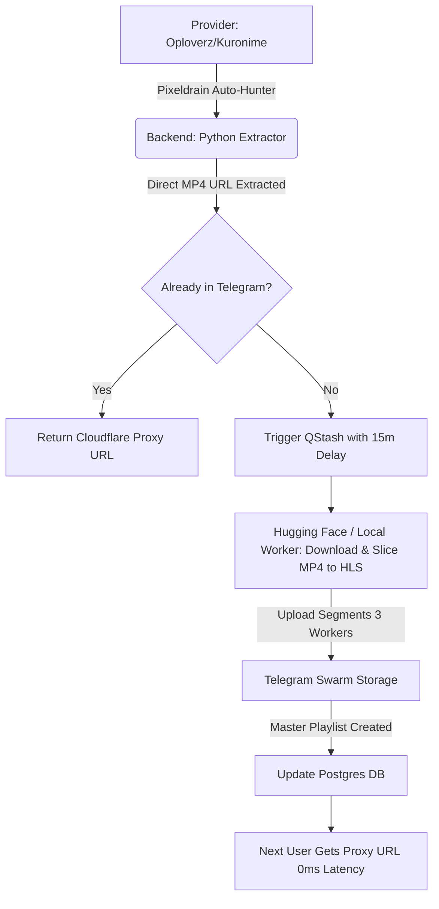

# 🏗️ Arsitektur Sistem: anime-scraper-pro (V2.0)

Dokumen ini memetakan seluruh ekosistem teknis, infrastruktur, dan filosofi pengembangan proyek **anime-scraper-pro**. Dirancang dengan prinsip **Efficiency-First**, **$0 Cost Infrastructure**, dan **Apple Human Interface Guidelines (HIG)**.

---

## 1. 🚀 Core Philosophy
- **Agentic Loops:** Menggunakan Gemini CLI sebagai orkestrator utama untuk melakukan *Analyze, Summarize, & Transform*.
- **Source-First Strategy:** Data metadata (AniList) hanya ditampilkan jika sumber video (Oploverz/Kuronime/Samehadaku) dipastikan ada (Verified Existence).
- **Strict Direct Stream (No Iframe):** Mengutamakan ekstraksi link mentah (.m3u8/.mp4) untuk pengalaman menonton tanpa iklan. Iframe fallback ditiadakan demi menjaga kualitas *Enterprise*.
- **Hybrid Distributed Workers:** Menggunakan pendekatan *Zigzag Multitasking* (Lokal + Cloud Hugging Face) untuk mempercepat proses *Ingestion* tanpa membebani satu server.
- **Fail-Fast & Resilient:** Menggunakan *Exponential Backoff* saat menghadapi *Rate Limit* Telegram (Error 429) dan *Delay Queue* (Upstash QStash) untuk pemrosesan sekuensial yang aman.

---

## 2. 🛠️ Tech Stack (The "70% Python" Powerhouse)

| Layer | Teknologi | Peran Utama |
| :--- | :--- | :--- |
| **Frontend** | Next.js 15 (App Router) | UI Premium (Apple Style), Edge Rendering, Multi-Resolution Player. |
| **Backend** | FastAPI (Python 3.11) | Aggregator Logic, Scraper Engine, Resolver. |
| **Database** | Upstash Redis & Neon Postgres | State Management, Home Data Cache, Dist. Locking, Episodes DB. |
| **Storage** | Telegram Swarm Storage | *Unlimited $0 Object Storage* untuk segmen HLS (.ts). |
| **Queue** | Upstash QStash | Manajemen antrean *Ingestion* dengan fitur *Delayed Delivery*. |
| **Deployment** | Cloudflare Pages/Workers | Host Frontend (Edge Runtime) & Proxy Telegram (`tg-proxy`). |
| **Runner** | Hugging Face Spaces (Docker) | Host Backend Scraper & Cloud Ingestion Worker 24/7 (Free Tier). |

---

## 3. 🐳 Hugging Face Infrastructure (Backend)
Backend dijalankan menggunakan **Docker** di Hugging Face Spaces untuk stabilitas 24/7.
- **Port:** `7860` (Standar HF Spaces).
- **Background Queue:** Menerima *webhook* dari QStash secara sekuensial (dengan jeda waktu misal 15 menit per tugas) untuk mencegah OOM (Out of Memory).
- **Pixeldrain Auto-Hunter:** Secara otomatis membongkar halaman *download* *provider* (seperti Oploverz) untuk mencari link Pixeldrain beresolusi 720p/1080p sebagai bahan baku *Ingestion* yang paling stabil (bebas IP Lock/CORS).

---

## 4. 🔗 Data Flow & Architecture (Swarm Ingestion)

---

## 5. 🗺️ Pemetaan Folder Inti
- `apps/api`: Mesin utama Python (FastAPI).
    - `services/providers`: Logika spesifik sumber (Oploverz, Otakudesu, Kuronime, Samehadaku, dll).
    - `services/ingestion`: Mesin Pemotong (FFmpeg Slicer) dan Pengunggah (Telegram Uploader).
    - `routes`: Endpoint API (termasuk webhook QStash).
- `apps/web`: Antarmuka Next.js.
    - `app`: Rute UI (Home, Watch, Detail).
    - `ui/player`: Komponen VideoPlayer canggih pendukung HLS.js dan *Multi-Resolution Switcher*.
- `archive`: Kumpulan skrip *debugging*, injeksi manual, dan *testing* yang diarsipkan agar *root directory* tetap bersih.

---

## 6. 📅 Future Expansion
1. **P2P WebRTC (p2p-media-loader):** Meringankan beban *bandwidth* Cloudflare Worker dengan membuat penonton saling berbagi segmen video.
2. **Multi-Season Auto-Hunter:** Memperluas skrip otomatis pencari Pixeldrain untuk Season 2, Season 3, dan judul anime besar lainnya.
3. **Adaptive Bitrate (ABR) Master Playlist:** Menjahit resolusi 1080p, 720p, dan 480p ke dalam satu file `.m3u8` jika server mendapatkan *upgrade* CPU.

---
*Last Updated: Today*
*Author: Gemini CLI x Developer*
