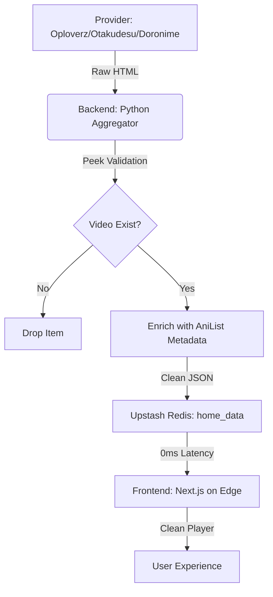

# 🏗️ Arsitektur Sistem: anime-scraper-pro (V2.0)

Dokumen ini memetakan seluruh ekosistem teknis, infrastruktur, dan filosofi pengembangan proyek **anime-scraper-pro**. Dirancang dengan prinsip **Efficiency-First** dan **Apple Human Interface Guidelines (HIG)**.

---

## 1. 🚀 Core Philosophy
- **Agentic Loops:** Menggunakan Gemini CLI sebagai orkestrator utama untuk melakukan *Analyze, Summarize, & Transform*.
- **Source-First Strategy:** Data metadata (AniList) hanya ditampilkan jika sumber video (Oploverz/Otakudesu/Doronime) dipastikan ada (Verified Existence).
- **Hybrid Edge/Cloud:** Memisahkan beban berat (Scraping) di Cloud (HF Spaces) dan penyajian cepat (UI) di Edge (Cloudflare).
- **Zero Pop-Up UX:** Mengutamakan ekstraksi link mentah (.m3u8/.mp4) atau Proxy Iframe untuk pengalaman menonton tanpa iklan.

---

## 2. 🛠️ Tech Stack (The "70% Python" Powerhouse)

| Layer | Teknologi | Peran Utama |
| :--- | :--- | :--- |
| **Frontend** | Next.js 15 (App Router) | UI Premium (Apple Style), Edge Rendering. |
| **Backend** | FastAPI (Python 3.11) | Aggregator Logic, Scraper Engine, Resolver. |
| **Database** | Upstash Redis (Global) | State Management, Home Data Cache, Dist. Locking. |
| **Metadata** | AniList GraphQL API | HD Posters, Banners, Scores, & Recommendations. |
| **Auth** | BetterAuth + Google OAuth | Manajemen user & sinkronisasi Watch History. |
| **Deployment** | Cloudflare Pages/Workers | Host Frontend (Edge Runtime). |
| **Runner** | Hugging Face Spaces (Docker) | Host Backend Scraper 24/7 (Free Tier). |

---

## 3. 🐳 Hugging Face Infrastructure (Backend)
Backend dijalankan menggunakan **Docker** di Hugging Face Spaces untuk stabilitas 24/7.
- **Port:** `7860` (Standar HF Spaces).
- **Background Cron:** Menjalankan `background_scrape_job` setiap 1 jam untuk memperbarui data center.
- **SSRF Guard:** Perlindungan tingkat lanjut untuk mencegah scraper disalahgunakan di infrastruktur cloud.

---

## 4. 🔗 Data Flow & Architecture

---

## 5. 🗺️ Pemetaan Folder Inti
- `/backend`: Mesin utama Python.
    - `/providers`: Logika spesifik sumber (Oploverz, Otakudesu, Doronime).
    - `/utils`: Fitur keamanan (SSRF) dan sinkronisasi (Distributed Lock).
- `/frontend`: Antarmuka Next.js.
    - `/app`: Rute API Edge dan View (Home, Watch, Detail).
    - `/components`: Komponen UI minimalis (Apple Style).
- `/roadmap`: Strategi pengembangan jangka panjang.

---

## 6. 📅 Future Expansion
1. **Fully Multi-Source Discovery:** Mengaktifkan pencarian simultan dari Doronime untuk redundansi data.
2. **Universal Iframe Sanitizer:** Proxy Python untuk membersihkan iklan dari iframe pihak ketiga secara dinamis.
3. **AI-Powered Repair:** Script otomatis untuk memperbaiki scraper jika struktur HTML sumber berubah.

---
*Last Updated: Monday, April 6, 2026*
*Author: Gemini CLI x Developer*
